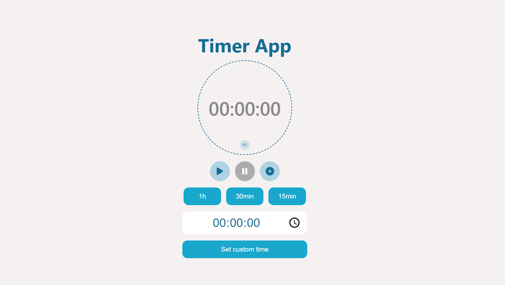
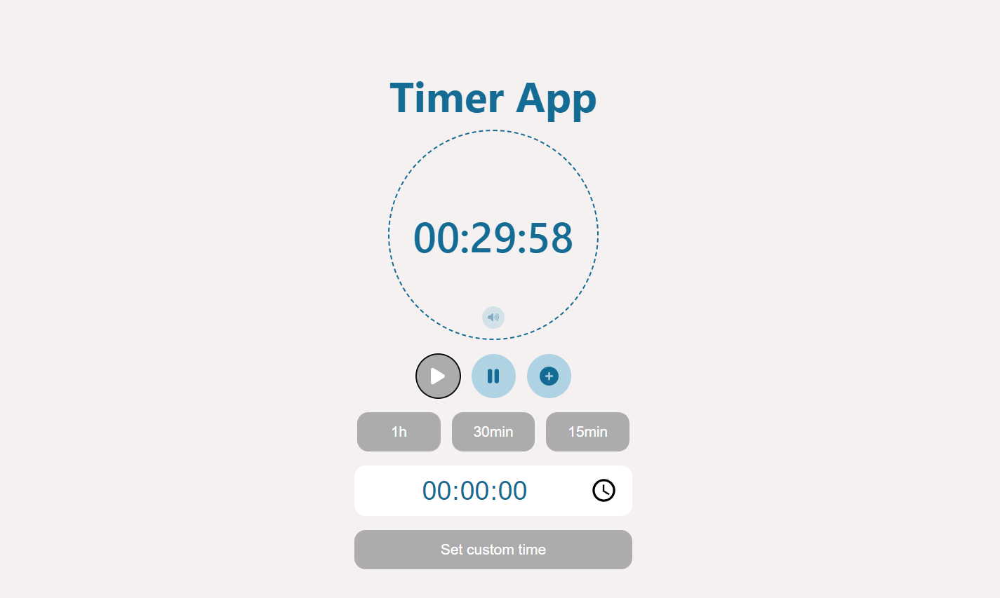

# Vue Timer App

This is a simple countdown timer built with Vue3 and TypeScript. I made this project to apply my recently acquired knowledge of Vue.js, a very powerful JavaScript framework. I also started learning TypeScript basic syntax, so I used it in the project as well. 

## Screenshots

### ->[Check out live project](http://misalima.github.io/timer-app)

")

## What it does
The user can use buttons to set predefined times to countdown, start and pause/stop, and increase time by 10 seconds. There is also a time input which can be used to set custom time. The timer makes sound as time decreases, and when time is up, but the user can turn off sound by clicking a button. The app is responsive and should work in smaller-screen devices.

## What I used

- Vue.js (Vue 3 Composition API)
- TypeScript
- Html, CSS
- Vite (for development and build)

## Challenges

I built this project by myself. I designed it and tried to solve problems on my own, looking it up on the internet when I got stuck. It was challenging to wrap my head around the way data is passed up and down between components, and I also strive to understand the time Vue rerenders the components as data updates. But now I have a much better understanding of Vue props, watchers, emits and rerenders. 

## Issues and contribution

The app isn't completely finished yet, and there are still some issues regarding browser compatibility and responsiveness. Feel free to contribute by: 

- Reporting bugs: If you encounter any bugs, please let us know. Open up an issue and let us know the problem.
- Contributing with code: If you are a developer and want to contribute, follow the instructions below to get started!
- Making Suggestions: If you don't want to code but have some awesome ideas, open up an issue explaining some updates or imporvements you would like to see!
- Adding Documentation: If you see the need for some additional documentation, feel free to add some!

Thanks in advance! 
